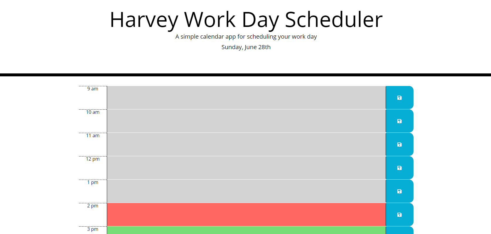
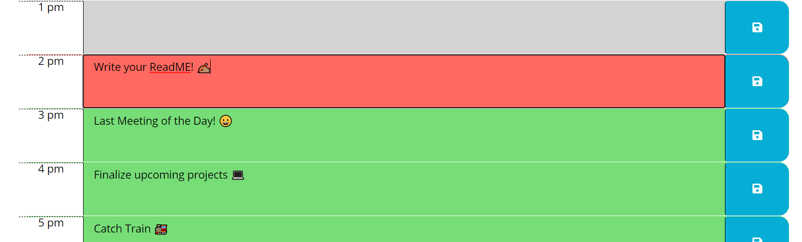

## Harvey Work Day Planner
Are you tired of post it notes to remind you of important meetings or appointments during the workday?

The Harvey Work Day Planner will keep you focused on your 9am-5pm work hour. Each day your calendar will update with the current date. When you schedule that appointment or when you're assigned a deadline add it to the 1 hour slot. 

If you have an appointment currently scheduled the time slot will appear in RED
If you have an appointment scheduled in the future the time slot will appear in GREEN
If you have an appointment scheduled in the past the time slot will appear in Gray

If you click the SAVE button and then refresh all of your appointments will be saved for the current browser session and appear even if you close out the browser window. Give it a try!

## Why should you use the Harvey Work Day Planner?
Let this application keep you focused on the daily tasks at hand and save your progress to look back at how far you have come in your 8 hours of work. 

## Features
Ability to type, save, and refresh without losing track of your appointments 

